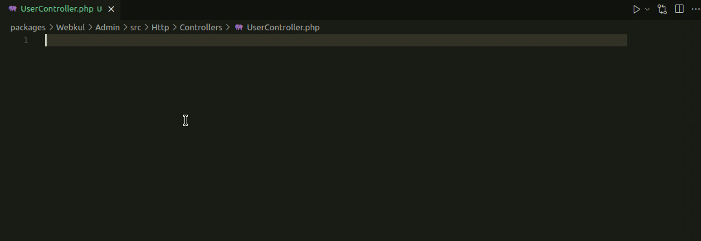
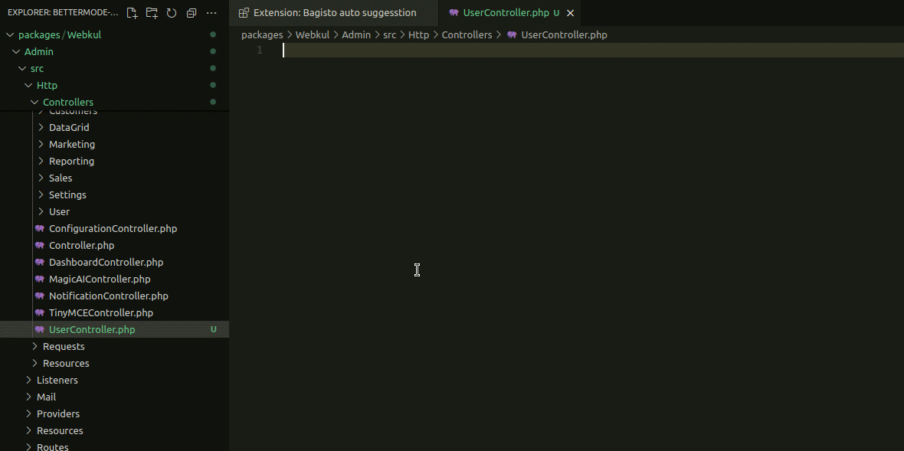
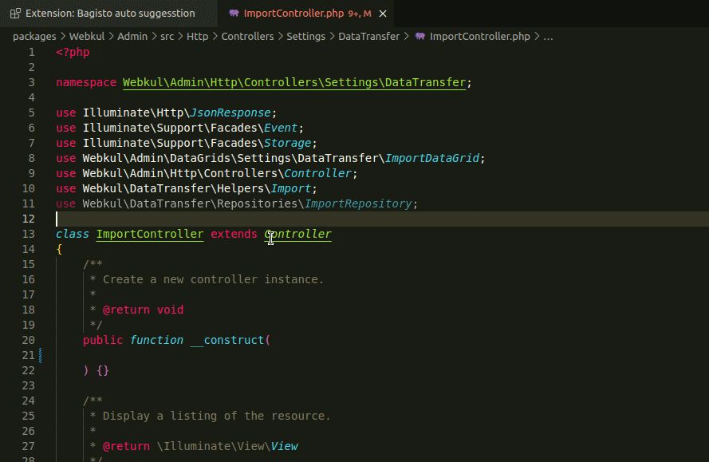
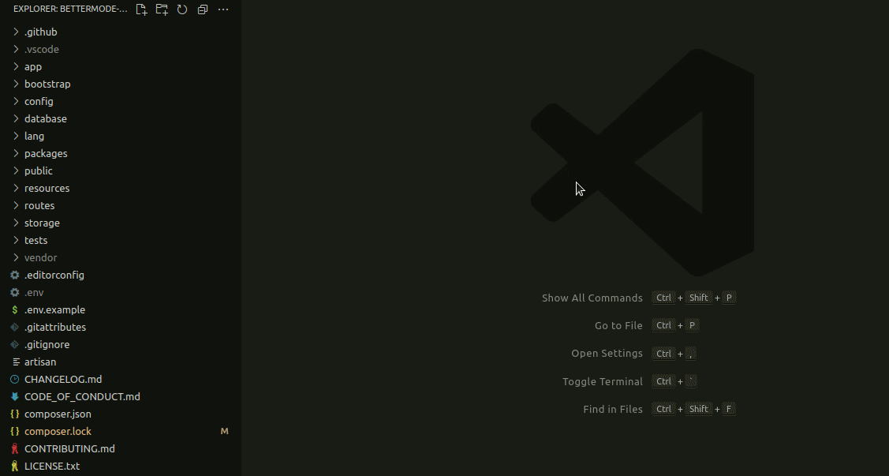
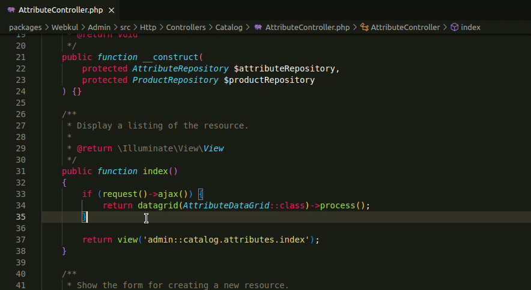

# Bagisto Auto Suggesstion Extension

## Overview
This Visual Studio Code extension is specifically designed to enhance productivity when developing Bagisto-based PHP projects. It provides several powerful features to simplify and speed up the coding process by offering auto-suggestions, commands, and tools tailored for <a href="https://bagisto.com/" target="_blank">Bagisto</a> development.

---

## Features

### 1. **Class Import Suggestions**
- **Trigger:** Type `wkcl` to view suggestions for importing Bagisto classes.

  

- **Functionality:** This feature suggests commonly used Bagisto classes for quick and easy imports.

### 2. **Class Template Command**
- **Command:**
  1. Press `Ctrl + Shift + P`.
  2. Find and select **Bagisto PHP Class Template**.

  

- **Functionality:**
  - Generates and inserts a dummy Bagisto class template into your file for rapid development.

### 3. **Bagisto Component Import Suggestions**
- Import commonly used Bagisto components like **Repositories**, **Models**, **Controllers**, **Contracts** and **Helpers** using these triggers:
  - `wkco` for Controllers
  - `wkre` for Repositories
  - `wkmo` for Models
  - `wkhe` for Helpers
  - `wkcn` for Contracts

  

- **Functionality:**
  - Provides auto-suggestions for importing these components directly into your code.

### 4. **Dependency Injection in Constructor**
- **Trigger:** Type `wkpr` within the `__construct` method to view suggestions for injecting dependencies.

  

- **Functionality:**
  - Suggests Bagisto classes for dependency injection.
  - Ensures already injected classes are excluded from the suggestions.

### 5. **Create Bagisto Module Command**
- **Command:**
  1. Press `Ctrl + Shift + P`.
  2. Find and select the **Create Bagisto Module** command.
  3. Enter your package name.

  

- **Functionality:**
  - Automatically generates the basic Bagisto module structure, including essential files and folders.
  - Simplifies the initial setup process for creating new Bagisto modules.

### 6. **Event Import Suggestions**
- **Trigger:** Type `wkev` to view suggestions for importing Bagisto Events.

    

- **Functionality:** This feature suggests Bagisto all events for quick and easy imports.
---

## How to Use

1. **Install the Extension:**
   - Search for the Bagisto PHP Extension in the Visual Studio Code marketplace and install it.

2. **Activate Features:**
   - Use the specified triggers or commands to activate different functionalities.

3. **Customize Your Workflow:**
   - Integrate the features seamlessly into your Bagisto development workflow to save time and improve code quality.

---

## Requirements
- Visual Studio Code (latest version recommended)
- PHP 7.4 or higher
- Bagisto project setup

---

## Contribution
Contributions are welcome! Feel free to submit issues or pull requests to improve the extension.

---

## License
This extension is licensed under the [MIT License](LICENSE).
